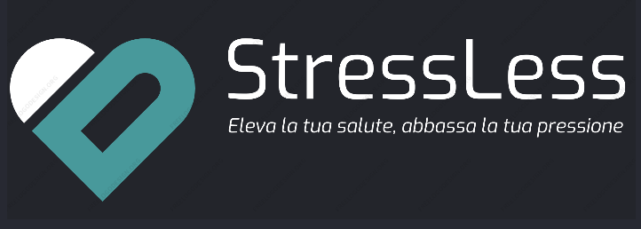

# StressLess

Design of a telemedicine system for a clinical service for the management of hypertensive patients.

The system allows the interaction of two main actors, the specialist doctor and the patient. After authenticating, the patient can store daily blood pressure measurements (two values, systolic pressure (SBP) and diastolic pressure (DBP), for example, 120/80), any symptoms (fatigue, nausea, headaches, and so on), and the intake of antihypertensive medications as prescribed by the specialist (day, time, medication, and quantity taken). Any concurrent symptoms, conditions, and/or therapies should be appropriately reported by the patient, including the indication of the symptom, therapy, condition, and associated timeframe.

The specialist doctor can specify the antihypertensive therapies that patients should follow. For each therapy, the doctor specifies the medication, the number of daily doses, the quantity of medication for each dose, and any instructions (e.g., after meals, away from meals, and so on). The doctor can view patient data, even in a summarized form (e.g., blood pressure trends week by week or month by month). The doctor can add or modify therapies based on the patient's evolving condition. Additionally, the doctor can update a brief section of patient information, including risk factors (smoker, former smoker, alcohol or substance abuse problems, risk of obesity), past medical conditions, present comorbidities

 
  
  
  
  
  
  

## Documentation
You can find all the specific documentation of this project in Elaborato_Ingegneria.pdf
